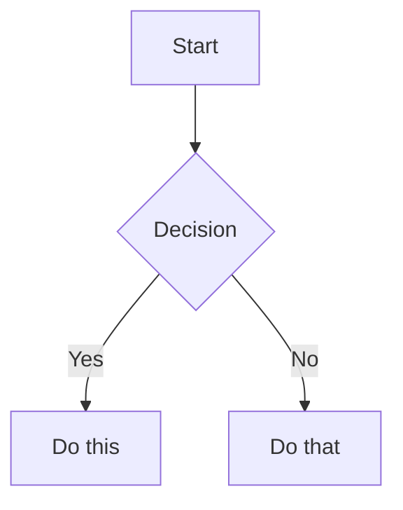

# Content Authoring Instructions — Diplodocus

Instructions for agents and contributors creating or editing content in
`spaces/`. Read this in full before writing any `.md` files or adding
any attachments.

---

## Space and file structure

A **space** is a folder directly inside `spaces/`. Each space maps to one
documentation site section (e.g. `getting-started`, `api-reference`).

```
spaces/
└── {space-slug}/
    ├── 01-page-title.md
    ├── 02-another-page.md
    ├── attachments/
    │   ├── README.md          ← index of all files in this folder
    │   ├── 01a-hero.png
    │   └── 02a-diagram.png
    └── ...
```

### Page naming rules

- Prefix every page with a **two-digit number** followed by a hyphen: `01-`, `02-`, …
- Use kebab-case for the rest of the filename: `03-folder-structure.md`
- The number controls sort order in the sidebar — gaps are fine (`01`, `03`, `07`)
- Never use spaces or uppercase letters in filenames

### Attachment naming rules

- Every attachment lives in `attachments/` inside its space folder
- Prefix with the **page number + a letter** for ordering within that page:
  `05a-diagram.png`, `05b-screenshot.png`, `05c-data.csv`
- This makes it easy to find and prune attachments when a page is deleted
- Always add a row to `attachments/README.md` for every file you add

---

## Page structure

Every page follows this layout:

```markdown
# Page Title

One-sentence summary of the page.

---

## Section heading

Content…

## Another section

Content…

---

## Next

- [Next page title](NN-next-page.md)
- [Related page](NN-related.md)
```

### Rules

- The **first line** must be `# H1 Title` — this becomes the sidebar label
- Use `##` and `###` for sections and subsections — the TOC only indexes these two levels
- Do not use H1 (`#`) anywhere else on the page
- Add a `---` separator before the `## Next` navigation block at the bottom
- The `## Next` block should list 2–4 logical next destinations with relative links

---

## Headings and TOC

The table of contents is built from `##` and `###` headings only.

| Level | Use for |
|---|---|
| `#` | Page title — one per page, first line only |
| `##` | Major sections |
| `###` | Subsections within a major section |
| `####` | Rarely needed; not included in TOC |

---

## Links

### Internal link — same space

Use a relative path to the `.md` file:

```markdown
[Installation](02-installation.md)
[Attachments & Images](05-attachments-and-images.md)
```

### Anchor link — current page

Every heading gets a slug (lowercase, spaces → hyphens). Link with `#slug`:

```markdown
[Jump to best practices](#best-practices)
```

### Anchor link — another page

Combine path + anchor:

```markdown
[Callout types](08-tables-and-callouts.md#callouts)
```

### Cross-space link

Go up one level, then into the sibling space:

```markdown
[API overview](../api-reference/01-overview.md)
```

### External link

Absolute URLs are passed through unchanged:

```markdown
[Mermaid.js](https://mermaid.js.org)
```

### Attachment link (download)

```markdown
[Download sample data (CSV)](attachments/05c-data.csv)
```

---

## Images

Always use attachments — never hotlink external images.

```markdown

```

- Alt text must be descriptive (`Folder structure diagram`, not `img`)
- Image files must exist in `attachments/` before the page is published
- Use the page-number naming convention: `12a-` for the first image on page `12`
- Maximum recommended file size: **2 MB** — link to a download for larger files

### Image in a table cell

```markdown
| Diagram | Description |
|---|---|
|  | Caption here |
```

---

## Callouts

Diplodocus has no custom callout syntax — use blockquotes with a bold label:

```markdown
> **Note** — Body text here.

> **Tip** — Body text here.

> **Warning** — Body text here.

> **Danger** — Body text here.

> **Example** — Body text here.
```

For multi-paragraph callouts, prefix every line with `>`:

```markdown
> **Note** — First paragraph.
>
> Second paragraph.
>
> ```bash
> # Code inside a callout
> php cli.php lint
> ```
```

Choose the label that matches intent:

| Label | Use when |
|---|---|
| **Note** | Extra context or background |
| **Tip** | Optional but helpful guidance |
| **Warning** | May cause problems if ignored |
| **Danger** | Destructive / security-critical |
| **Example** | Concrete illustration of the concept |

---

## Code blocks

Always add a language hint after the opening fence:

````markdown
```php
echo "Hello";
```
````

Common language hints: `php`, `js`, `ts`, `bash`, `json`, `yaml`, `sql`,
`html`, `css`, `diff`, `mermaid`.

For inline code use single backticks: `` `php cli.php lint` ``.

---

## Diagrams (Mermaid)

Use a fenced block with the `mermaid` language hint:

````markdown

````

Supported diagram types: `flowchart`, `sequenceDiagram`, `erDiagram`,
`classDiagram`, `gantt`, `pie`.

See [Mermaid.js documentation](https://mermaid.js.org/intro/) for full syntax.

---

## Tables

Use pipe syntax. Alignment is optional but recommended for readability:

```markdown
| Left | Centre | Right |
|:---|:---:|---:|
| text | text | 123 |
```

- Prefer more rows over nested lists inside cells
- Use `<ul><li>…</li></ul>` raw HTML only when a list inside a cell is unavoidable
- For very wide tables, consider linking to a CSV in `attachments/`

---

## Task lists

```markdown
- [x] Completed item
- [ ] Incomplete item
```

---

## Creating a new page — checklist

Before writing the page content:

1. Choose the correct numeric prefix for sidebar order
2. Create the file at `spaces/{space}/NN-page-slug.md`
3. If the page needs images or downloads, add them to `spaces/{space}/attachments/`
   using the `NNx-description.ext` naming convention
4. Add a row for each attachment to `spaces/{space}/attachments/README.md`

In the file:

- [ ] First line is `# Page Title`
- [ ] All images use `attachments/NNx-description.ext` paths
- [ ] All internal links use relative `.md` file paths
- [ ] All external links use full `https://` URLs
- [ ] Page ends with a `## Next` block linking to 2–4 related pages
- [ ] No H1 headings other than the page title

---

## Reference page

The [Markdown Sample](../spaces/getting-started/12-markdown-sample.md) page in
the `getting-started` space demonstrates every element above in rendered form.
Use it as a visual reference when checking your output.
