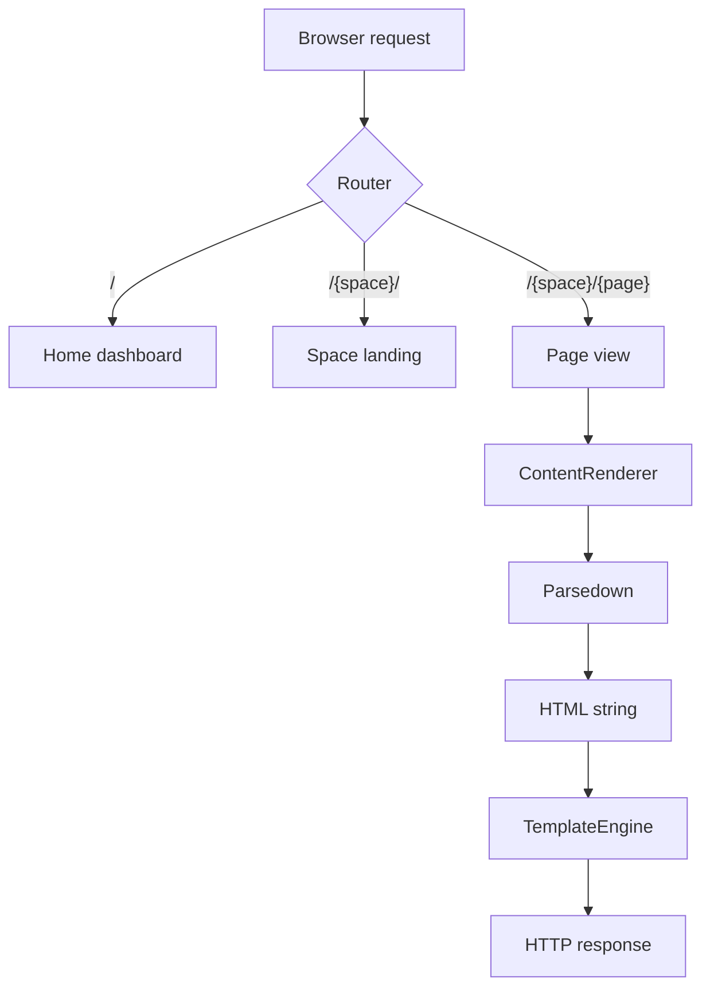
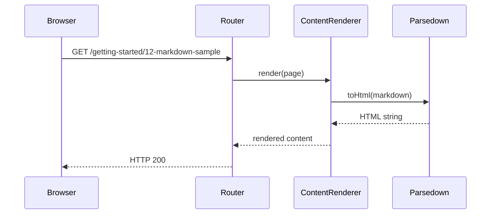
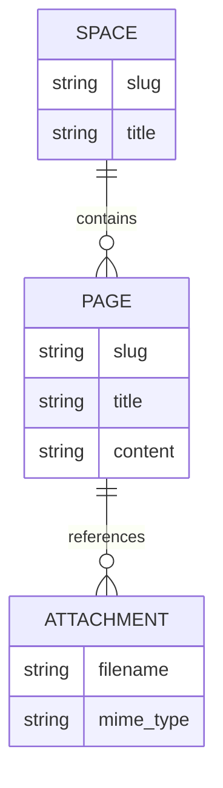

# Markdown Sample

A complete reference showing every supported element. Use this page to verify
rendering or as a copy-paste starting point when authoring new content.

---

## Contents

- [Headings](#headings)
- [Inline formatting](#inline-formatting)
- [Paragraphs and line breaks](#paragraphs-and-line-breaks)
- [Lists](#lists)
- [Blockquotes and callouts](#blockquotes-and-callouts)
- [Code](#code)
- [Tables](#tables)
- [Images](#images)
- [Links](#links)
- [Task lists](#task-lists)
- [Horizontal rules](#horizontal-rules)
- [Diagrams](#diagrams)

---

## Headings

Use `#` through `####` for four levels of hierarchy:

## H2 — Section heading
### H3 — Subsection heading
#### H4 — Detail heading

> **Note** — H1 is reserved for the page title (the very first line of the
> file). Use H2 and H3 for sections and subsections throughout the page.

---

## Inline formatting

| Style | Syntax | Result |
|---|---|---|
| Bold | `**bold**` | **bold** |
| Italic | `_italic_` | _italic_ |
| Bold + italic | `**_both_**` | **_both_** |
| Strikethrough | `~~struck~~` | ~~struck~~ |
| Inline code | `` `code` `` | `code` |

Mixed: This sentence has **bold**, _italic_, ~~struck~~, and `inline code`
all in one line.

---

## Paragraphs and line breaks

A blank line between two blocks of text creates a new paragraph. This is the
most common way to separate ideas in a page.

A second paragraph starts here. Lorem ipsum dolor sit amet, consectetur
adipiscing elit. Sed do eiusmod tempor incididunt ut labore et dolore magna
aliqua. Ut enim ad minim veniam, quis nostrud exercitation ullamco.

To force a line break within a paragraph without starting a new one,
add two trailing spaces before pressing Enter — like the break above.

---

## Lists

### Unordered

- Item one
- Item two
  - Nested item A
  - Nested item B
    - Deeply nested item
- Item three

### Ordered

1. First step
2. Second step
   1. Sub-step A
   2. Sub-step B
3. Third step

### Mixed (ordered + unordered)

1. Prepare the environment
   - Install PHP 7.4+
   - Configure your web server
2. Drop your `spaces/` folder in place
3. Open a browser and visit the root URL

---

## Blockquotes and callouts

A plain blockquote (no label):

> This is a plain blockquote. It has no labelled type — useful for quoting
> external sources or adding general context.

### Callout types

Diplodocus uses the `**Label** — body` pattern inside a blockquote:

> **Note** — Informational context. Use for background or extra detail the
> reader might want but doesn't strictly need.

> **Tip** — A suggestion or best practice. Helpful but optional.

> **Warning** — Something the reader should pay attention to; won't break
> things immediately but could cause problems if ignored.

> **Danger** — A destructive action, security risk, or something that will
> break things if ignored. Do not skip.

> **Example** — A concrete illustration of the concept described above.

### Multi-paragraph callout

> **Note** — The first paragraph of a multi-paragraph callout.
>
> The second paragraph continues in the same block. Keep every line prefixed
> with `>` to stay inside the same callout.
>
> ```bash
> # You can nest code blocks inside callouts too
> php cli.php lint spaces/getting-started/
> ```

---

## Code

### Inline code

Use `php cli.php lint` to check your pages. Set `default_theme` to `"dark"`
in `config.php` to enable dark mode.

### Bash

```bash
#!/usr/bin/env bash
for file in spaces/getting-started/*.md; do
    echo "Linting: $file"
    php cli.php lint "$file"
done
```

### PHP

```php
<?php
declare(strict_types=1);

function slugify(string $heading): string {
    return strtolower(preg_replace('/\s+/', '-', trim($heading)));
}
```

### JavaScript

```js
document.querySelectorAll('[data-copy-target]').forEach(btn => {
    btn.addEventListener('click', () => {
        navigator.clipboard.writeText(btn.dataset.copyTarget);
    });
});
```

### JSON

```json
{
  "app_name": "Diplodocus",
  "default_theme": "light",
  "excluded_dirs": ["src", "lib", "assets"]
}
```

### Diff

```diff
- 'default_theme' => 'dark',
+ 'default_theme' => 'light',
- 'app_name' => 'Documentation',
+ 'app_name' => 'Diplodocus',
```

---

## Tables

### Basic

| Column A | Column B | Column C |
|---|---|---|
| One | Two | Three |
| Four | Five | Six |

### Alignment

| Left aligned | Centre aligned | Right aligned |
|:---|:---:|---:|
| Text | Text | 1,234 |
| More text | More text | 56,789 |
| Final row | Final row | 0.99 |

### With rich content (emoji, inline code, bold)

| Feature | Status | Notes |
|---|---|---|
| Sidebar | ✅ Done | Auto-built from folder structure |
| TOC | ✅ Done | Uses `##` and `###` only |
| Search | ⚠️ In progress | Client-side filter for now |
| Dark mode | ✅ Done | `data-theme="dark"` on `<html>` |
| PDF export | 🔴 Planned | Target: **v2** |

---

## Images

An inline image from this space's `attachments/` folder:


Images inside table cells:

| Preview | Caption |
|---|---|
|  | The Diplodocus welcome page hero image |

> **Tip** — Name attachment files using the page-number prefix convention:
> `12a-description.png` for the first image on page `12`.
> See [Attachments & Images](05-attachments-and-images.md) for the full guide.

---

## Links

### Internal — same space

- [Welcome](01-welcome.md)
- [Installation](02-installation.md)
- [Folder structure](03-folder-structure.md)
- [Attachments & Images](05-attachments-and-images.md)

### Anchor — this page

- [Jump to Tables](#tables)
- [Jump to Code](#code)
- [Jump to Diagrams](#diagrams)

### Anchor — another page

- [Callout types on Tables & Callouts page](08-tables-and-callouts.md#callouts)
- [Best practices on Linking page](06-linking-between-pages.md#best-practices)

### External

- [CommonMark specification](https://spec.commonmark.org)
- [Mermaid.js documentation](https://mermaid.js.org)
- [Parsedown on GitHub](https://github.com/erusev/parsedown)

### Attachment download link

- [Download sample attachment (PNG)](attachments/01a-hero.png)

---

## Task lists

- [x] Write the markdown sample page
- [x] Add a mermaid diagram section
- [x] Use the existing hero image as an attachment reference
- [ ] Replace placeholder images in `attachments/` with real screenshots
- [ ] Publish to production

---

## Horizontal rules

Three or more hyphens on their own line produce a thematic break:

---

Use them to separate major sections within a long page — like the breaks
throughout this page.

---

## Diagrams

Diplodocus renders fenced ` ```mermaid ` blocks using
[Mermaid.js](https://mermaid.js.org/). No installation required.

### Flowchart — request lifecycle



### Sequence diagram — page render



### Entity-relationship — content model



---

## Next

- [Welcome](01-welcome.md)
- [Attachments & Images](05-attachments-and-images.md)
- [Linking between pages](06-linking-between-pages.md)
- [Code blocks & highlighting](07-code-blocks-and-highlighting.md)
- [Tables & callouts](08-tables-and-callouts.md)
