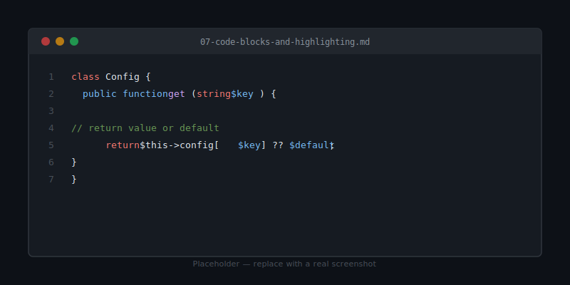

# Code Blocks & Highlighting

Diplodocus uses [highlight.js](https://highlightjs.org/) for syntax
highlighting. 190+ languages ship out of the box.



## Basic usage

Fence the block with triple backticks and add a language hint:

````markdown
```php
echo "Hello, Diplodocus";
```
````

Renders:

```php
echo "Hello, Diplodocus";
```

## Common languages

### PHP

```php
<?php
declare(strict_types=1);

namespace Diplodocus;

class Config
{
    public function get(string $key, $default = null)
    {
        return $this->config[$key] ?? $default;
    }
}
```

### JavaScript

```js
const pages = await fetch('/api/pages')
  .then(r => r.json())
  .then(data => data.filter(p => p.published));

console.log(`Loaded ${pages.length} pages`);
```

### TypeScript

```ts
interface Page {
  slug: string;
  title: string;
  content: string;
  attachments?: string[];
}

function isPublished(page: Page): boolean {
  return !page.slug.startsWith('_');
}
```

### Python

```python
from pathlib import Path

def find_markdown_files(root: Path) -> list[Path]:
    return sorted(root.rglob('*.md'))
```

### Go

```go
package main

import "fmt"

func main() {
    fmt.Println("Hello, Diplodocus")
}
```

### Rust

```rust
fn main() {
    let pages = vec!["welcome", "install", "structure"];
    for page in pages.iter() {
        println!("Page: {}", page);
    }
}
```

### Bash / shell

```bash
#!/usr/bin/env bash
set -euo pipefail

for file in getting-started/*.md; do
    echo "Linting $file"
    php cli.php lint "$file"
done
```

### JSON

```json
{
  "app_name": "Diplodocus",
  "stylesheets": [
    "assets/css/theme.css",
    "assets/css/diplodocus.css"
  ],
  "excluded_dirs": ["src", "lib", "assets"]
}
```

### YAML

```yaml
name: Deploy spaces
on:
  push:
    branches: [main]
jobs:
  deploy:
    runs-on: ubuntu-latest
    steps:
      - uses: actions/checkout@v4
      - run: php cli.php check-all
```

### SQL

```sql
SELECT page_slug, COUNT(*) AS views
FROM page_views
WHERE viewed_at > NOW() - INTERVAL 7 DAY
GROUP BY page_slug
ORDER BY views DESC
LIMIT 10;
```

### HTML

```html
<article class="prose prose-lg">
  <h1>Welcome</h1>
  <p>Diplodocus renders this automatically.</p>
</article>
```

### CSS

```css
:root {
  --dc-brand-primary: #1e3a5f;
  --dc-text-primary: #111827;
}
```

### Diff

```diff
- 'app_name' => 'Documentation',
+ 'app_name' => 'Diplodocus',
- 'default_theme' => 'dark',
+ 'default_theme' => 'light',
```

## Inline code

Wrap short snippets in single backticks: `const x = 1;`, `php cli.php lint`,
`--dc-brand-primary`.

## Changing the theme

Syntax colours live in `assets/css/theme.css`:

```css
--dc-hl-keyword: #ff7b72;
--dc-hl-string:  #79c0ff;
--dc-hl-number:  #f0883e;
--dc-hl-comment: #6a9955;
```

Edit those four lines to restyle every code block in every project.

## Copy-to-clipboard

Every code block has a copy button in the top-right on hover. The button
is added by `assets/js/app.js` — disable it by removing that behaviour
from the file.

## Next

- [Tables & callouts](08-tables-and-callouts.md)
- [Configuration](09-configuration.md)
