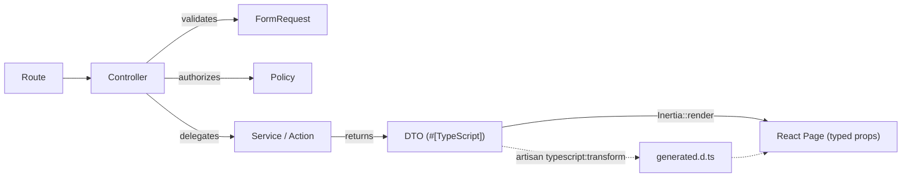

# Overview

My opinionated, reusable base for a **Laravel 13 + Inertia v2 + React (TypeScript) + Tailwind v4** application, tuned for **AI-assisted development** and **Hostinger shared hosting**. This project is the reference I copy from when starting anything new — the core setup and the best practices around it, nothing app-specific.

It documents the *skeleton and the conventions*, not a finished product: how the project is scaffolded, how data flows, how it's linted, how it deploys, and the AI-tooling docs that make an agent productive in the repo from minute one.

## The stack at a glance

| Layer | Choice | Version |
|---|---|---|
| Framework | Laravel | 13 (PHP 8.3+) |
| Auth scaffold | Laravel Breeze (React + Inertia + TS) | 2.x |
| Transport | Inertia.js (Laravel + React adapters) | v2 |
| UI | React + TypeScript | 18 / 5 |
| Styling | Tailwind CSS (`@theme` tokens, `@tailwindcss/vite`) | v4 |
| Routing helper | Ziggy | v2 |
| DTOs | `spatie/laravel-data` + `spatie/laravel-typescript-transformer` | v4 / v3 |
| Database | **PostgreSQL** (MySQL is a drop-in alternative) | 15+ |
| AI tooling | Laravel Boost (+ Pail, Pint) | v2 |
| JS quality | ESLint (Airbnb) + Prettier; `tsc --strict` | ESLint 9 |
| Deploy | GitHub Actions → FTP + SSH (Hostinger) | — |

## The core principle: one data-flow contract

Every request follows the same path. Backend owns logic, validation, and authorization; Inertia is a thin transport; React is UI only.

The DTO is the single source of truth: it is both the Inertia payload **and** the origin of the frontend's TypeScript types. Change a DTO, regenerate types, and the compiler tells you exactly what to fix on the frontend.

Each hop has one job:

| Layer | Owns | Never does |
|---|---|---|
| **FormRequest** | Validation — one per write action | Business logic |
| **Policy** | Authorization — one per resource (`$this->authorize('update', $post)`) | Validation |
| **Service** | Business logic shared across a feature | Rendering, request access |
| **Action** | One reusable operation (`CreatePostAction`), callable from controller, command, or job alike | Growing a second method — that's a service |
| **DTO** | The response shape | Exposing raw models |

> **Tip** — Extract an Action when a service method gets reused across entry points (web + artisan + job). Don't convert everything — services remain the default home for feature logic.

## What's in this guide

| Page | Covers |
|---|---|
| [Create the project](01-create-the-project.md) | Scaffolding, packages, directory layout, dev commands |
| [Database — PostgreSQL](02-database-postgresql.md) | DB choice, migration & seeder best practices |
| [DTOs & TypeScript](03-dtos-and-typescript.md) | The typed contract between Laravel and React |
| [Frontend — React & Tailwind](04-frontend-react-tailwind.md) | JS structure, Tailwind v4, Airbnb ESLint + Prettier, camelCase↔snake_case boundary |
| [AI-driven dev docs](05-ai-driven-dev-docs.md) | Boost, `AGENTS.md`/`CLAUDE.md`, copilot instructions, downloadable skills |
| [Environment & config](06-environment-and-config.md) | Nulled `.env.example`, `seeding.php`, why SSH never goes in config |
| [Remote commands](07-remote-commands.md) | The `remote:cmds` artisan tool (nulled copy attached) |
| [Deployment](08-deployment.md) | GitHub Actions workflow copies (FTP + SSH) |
| [.htaccess examples](09-htaccess-examples.md) | Root + `public/` hardened Apache configs for Hostinger |
| [Workspace & gitignore](10-workspace-and-gitignore.md) | `.code-workspace` excludes and the base `.gitignore` |
| [Feature flow & docs](11-feature-flow-and-docs.md) | The `.docs/feature/` brief → plan → implementation rhythm, tooling links |
| [Resources](12-resources.md) | The reading list — docs, educators, repos, patterns & anti-patterns |
| [SEO](13-seo.md) | `config/seo.php`, indexability switch, robots/sitemap, OG share image, JSON-LD |

> **Note** — The Hostinger/hPanel mechanics (enabling SSH, generating deploy keys, adding GitHub secrets) live in the sibling **GitHub Actions → Hostinger** project. This guide links to it rather than repeating it.

## Next

- [Create the project](01-create-the-project.md)
