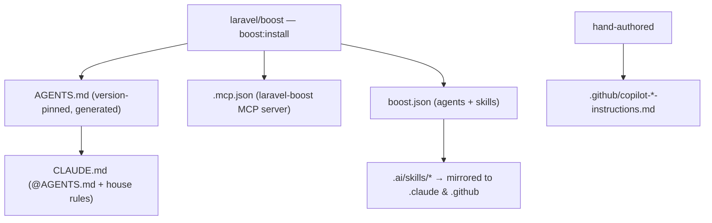

# AI-Driven Dev Docs

The point of this stack is that an AI coding agent is productive in the repo immediately — because the repo *tells it* how the project works. That's a layered set of docs and tooling, seeded by Laravel Boost and extended with hand-written instructions and skills.

## The layers



| Artifact | Written by | Purpose |
|---|---|---|
| `AGENTS.md` | Boost (`boost:update`) | Version-pinned ecosystem rules; the shared source of truth |
| `CLAUDE.md` | You | `@AGENTS.md` include + repo house rules |
| `.mcp.json` | Boost | Registers the `laravel-boost` MCP server |
| `boost.json` | You | Declares which agents + skills Boost distributes |
| `.ai/skills/*` | You | Authored once, mirrored to `.claude/` and `.github/` |
| `.github/copilot-*-instructions.md` | You | Deep architecture/DTO/frontend conventions |

## 1. Install Boost

```bash
composer require --dev laravel/boost
php artisan boost:install
```

This generates `AGENTS.md` (pinned to your exact installed versions), `boost.json`, and `.mcp.json`. The MCP server exposes read-only tools an agent should prefer over guessing: `database-schema`, `database-query`, `last-error`, `read-log-entries`, `browser-logs`, `get-absolute-url`, and `search-docs` (version-matched documentation).

```json
// boost.json
{
  "agents": ["claude", "copilot"],
  "guidelines": true,
  "mcp": true,
  "skills": ["laravel-best-practices", "inertia-react-development", "tailwindcss-development"]
}
```

Re-run `php artisan boost:update` after upgrading packages so `AGENTS.md` and the skills stay version-accurate.

## 2. CLAUDE.md — thin wrapper + house rules

`CLAUDE.md` imports the generated guidelines and adds the rules specific to *this* repo:

```markdown
# My App — Claude Code guidelines

@AGENTS.md

## House rules
- Verify user-facing changes in a **headed** browser (Playwright), not just tests.
- Prefer Boost MCP tools (`database-query`, `search-docs`) over raw SQL / guesswork.
- Structured logs: every backend log line is prefixed `[Controller@method]` so it's greppable.
- Don't write tests unless asked. When you do, use **file-based** SQLite so the DB persists for debugging.
```

## 3. The `.github/copilot-*-instructions.md` set

Boost can't generate the *architectural* conventions — those are hand-written and shared across agents. Keep them small and prescriptive:

| Doc | Carries |
|---|---|
| `copilot-laravel-inertia-react-instructions.md` | The master data-flow contract: `Controller → FormRequest → Service → DTO → Inertia::render → Page` |
| `copilot-react-instructions.md` | Frontend structure, casing split, feature isolation, dependency direction, barrel files |
| `copilot-dto-instructions.md` | The DTO contract, `#[TypeScript]`, "never expose models", the golden rule |
| `copilot-linting-instructions.md` | Airbnb ESLint + Prettier rules and the lint/format/type gates |

Each doc should end on the same note: *"This is the default standard. Deviations should be intentional and justified."*

## 4. Skills

Author skills **once** in `.ai/skills/`; `boost:update` mirrors copies into `.claude/skills/` and `.github/skills/` so every agent sees the same guidance. The baseline set:

- **`laravel-best-practices`** — backend patterns, with a `rules/*.md` folder (~20 topic files: architecture, eloquent, validation, migrations, security, caching, queues, testing, style…).
- **`inertia-react-development`** — the Inertia + React conventions in skill form.
- **`qa-testing`** — Playwright spec writing, headed verification, browser-log + DB-state checks paired with Boost tools (own `rules/`: boost, flows, playwright, recipes).
- **`tailwindcss-development`** — styling patterns (author for **v4** `@theme`; the stock skill assumes v3).
- **`debugging-with-boost`** — the Boost-first investigation loop + headed-browser reproduction.

**Download the full set** — my copilot skills exactly as they ship in a live project (drop into `.github/skills/` / `.ai/skills/`):

[📦 05a-copilot-skills.zip](attachments/05a-copilot-skills.zip) — `laravel-best-practices` (+20 rule files), `inertia-react-development`, `qa-testing` (+4 rule files)

> **Tip** — Treat `.ai/skills/` as the source of truth and the `.claude`/`.github` copies as build artifacts. Never hand-edit the mirrors — edit the source and re-run `boost:update`.

> **Danger** — These docs are only useful if they're *true*. When a version, path, or convention changes, update the doc in the same commit. A stale instruction is worse than none — an agent will follow it confidently off a cliff.

## Next

- [Environment & config](06-environment-and-config.md)
