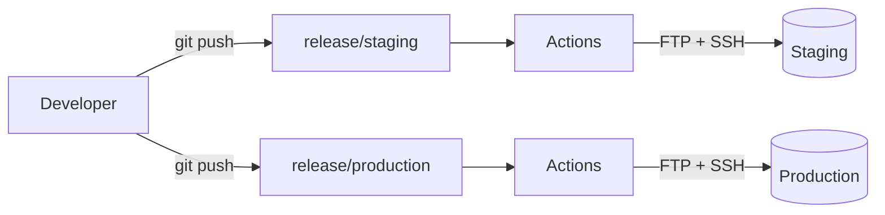

# Deployment

Deployment is a hybrid GitHub Actions job: **FTP** uploads changed files to Hostinger, then **SSH** runs post-deploy commands on the server. Two workflows, one per environment, triggered by pushes to release branches.

> **Note** — The Hostinger-side mechanics — enabling SSH in hPanel, generating a deploy key, and adding the `FTP_*` / `SSH_*` GitHub secrets — are documented step-by-step in the [GitHub Actions → Hostinger guide](https://diplodocus.joehunter.dev/git-actions-hostinger/overview). This page is the workflow copies and the branch model; follow that guide for first-time host setup.

## Branch model

| Branch | Environment | Workflow |
|---|---|---|
| `release/staging` | staging | `.github/workflows/deploy-staging.yml` |
| `release/production` | production | `.github/workflows/deploy-production.yml` |



Merge to `release/staging` to ship to staging; promote to `release/production` when it's verified. Everything sensitive is a GitHub **environment secret** (`FTP_SERVER`, `FTP_USER`, `FTP_PASS`, `FTP_PORT`, `FTP_SERVER_DIR`, `SSH_HOST`, `SSH_USER`, `SSH_PORT`, `SSH_PRIVATE_KEY`) — never in the YAML.

## `deploy-production.yml`

```yaml
name: Deploy to Production

on:
  push:
    branches:
      - release/production

jobs:
  deploy:
    runs-on: ubuntu-latest
    environment: production
    steps:
      - name: Checkout code
        uses: actions/checkout@v3
        with:
          fetch-depth: 0  # full history for the FTP diff

      - name: Deploy changed files via FTP
        uses: SamKirkland/FTP-Deploy-Action@v4.3.6
        with:
          server: ${{ secrets.FTP_SERVER }}
          username: ${{ secrets.FTP_USER }}
          password: ${{ secrets.FTP_PASS }}
          port: ${{ secrets.FTP_PORT }}
          protocol: ftp
          local-dir: ./
          server-dir: /public_html/
          state-name: .ftp-deploy-sync-state.json
          exclude: |
            .git/**
            .github/**
            .docs/**
            .private/**
            .vscode/**
            .idea/**
            node_modules/**
            vendor/**
            tests/**
            storage/logs/**
            storage/framework/cache/**
            storage/framework/sessions/**
            storage/framework/testing/**
            storage/framework/views/**
            .env*
            *.md
            **/*.md
            *.log
            .phpunit.cache
            .phpunit.result.cache
            phpunit.xml
            package*.json

      - name: Composer install (no-dev, optimized)
        uses: appleboy/ssh-action@v1.0.3
        with:
          host: ${{ secrets.SSH_HOST }}
          username: ${{ secrets.SSH_USER }}
          port: ${{ secrets.SSH_PORT }}
          key: ${{ secrets.SSH_PRIVATE_KEY }}
          script: |
            cd ${{ secrets.FTP_SERVER_DIR }}
            /opt/alt/php85/usr/bin/php /usr/local/bin/composer2 install --no-dev --no-interaction --optimize-autoloader
```

## `deploy-staging.yml`

Same shape, but keyed to `release/staging`, using a **separate sync-state file**, and clearing caches on the way in (staging tolerates the extra churn):

```yaml
name: Deploy to Staging

on:
  push:
    branches:
      - release/staging

jobs:
  deploy:
    runs-on: ubuntu-latest
    environment: staging
    steps:
      - name: Checkout code
        uses: actions/checkout@v3
        with:
          fetch-depth: 0

      - name: Deploy changed files via FTP
        uses: SamKirkland/FTP-Deploy-Action@v4.3.6
        with:
          server: ${{ secrets.FTP_SERVER }}
          username: ${{ secrets.FTP_USER }}
          password: ${{ secrets.FTP_PASS }}
          port: ${{ secrets.FTP_PORT }}
          protocol: ftp
          local-dir: ./
          server-dir: /public_html/
          state-name: .ftp-deploy-sync-state-staging.json   # separate state
          exclude: |
            .git/**
            .github/**
            .docs/**
            .private/**
            node_modules/**
            vendor/**
            tests/**
            storage/logs/**
            storage/framework/cache/**
            storage/framework/sessions/**
            storage/framework/testing/**
            storage/framework/views/**
            .env*
            *.md
            **/*.md
            *.log
            phpunit.xml
            package*.json

      - name: Composer install + clear caches
        uses: appleboy/ssh-action@v1.0.3
        with:
          host: ${{ secrets.SSH_HOST }}
          username: ${{ secrets.SSH_USER }}
          port: ${{ secrets.SSH_PORT }}
          key: ${{ secrets.SSH_PRIVATE_KEY }}
          script: |
            cd ${{ secrets.FTP_SERVER_DIR }}
            /opt/alt/php85/usr/bin/php /usr/local/bin/composer2 clear-cache
            /opt/alt/php85/usr/bin/php /usr/local/bin/composer2 install --no-dev --no-interaction --optimize-autoloader
            /opt/alt/php85/usr/bin/php artisan config:clear
            /opt/alt/php85/usr/bin/php artisan cache:clear
            /opt/alt/php85/usr/bin/php artisan route:clear
            /opt/alt/php85/usr/bin/php artisan view:clear
```

## Why exclude so much

FTP diff-uploads are faster the less they consider. Exclude anything that's **installed** (`vendor`, `node_modules`), **generated** (`storage/framework/*`), **environment-specific** (`.env*`), or **not needed on the server** (`.git`, `.github`, tests, docs, markdown).

| Pattern | Reason |
|---|---|
| `.env*` | Secrets stay on the server; never uploaded |
| `vendor/**`, `node_modules/**` | Installed via SSH `composer install` |
| `storage/framework/**`, `*.log` | Runtime/generated on the server |
| `.git/**`, `.github/**`, `*.md` | Not needed at runtime |

## FTP sync-state

`FTP-Deploy-Action` keeps `.ftp-deploy-sync-state.json` on the server to track what's been uploaded; the next run only sends what changed.

- **Don't delete it** — removing it forces a full re-upload.
- `.gitignore` it so it's never committed.
- To force a clean re-deploy, use `remote:cmds reset-sync` ([page 07](07-remote-commands.md)) or delete the file over SSH, then push.

> **Note** — The PHP path `/opt/alt/php85/usr/bin/php` and `composer2` are correct for **PHP 8.5 on Hostinger shared hosting**. On a different plan/version, confirm the paths first — a `test-ssh.yml` workflow that prints them is described in the **GitHub Actions → Hostinger** guide.

## Build note

This base deploys committed source and installs PHP deps on the server. If a step needs a Vite build (`npm ci && npm run build`), add a Node step **before** the FTP upload and stop excluding `public/build/**` — but keep the default lean until a project actually needs it.

## Next

- [.htaccess examples](09-htaccess-examples.md)
- [GitHub Actions → Hostinger guide](https://diplodocus.joehunter.dev/git-actions-hostinger/overview) — host setup, SSH keys, secrets, troubleshooting
