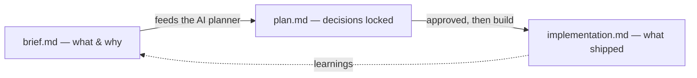

# Feature Flow & Project Docs

Every project carries a `.docs/` folder — the working memory of the repo. Features are developed **doc-first**: a brief captures intent, a plan locks the approach, an implementation records what was actually built. This is the same brief → plan → implementation rhythm the Diplodocus **feature-driven spec** renders, and it's the backbone of AI-assisted development here: the brief is what you hand the agent, the plan is what you approve, the implementation is the audit trail.

## The `.docs/` layout

```
.docs/
├── feature/                        # one folder per feature
│   ├── room-voting/
│   │   ├── room-voting-brief.md
│   │   ├── room-voting-plan.md
│   │   └── room-voting-implementation.md
│   └── pack-import/
│       └── pack-import-brief.md    # partial features are fine — brief first
├── .private/                       # never committed, never searched
│   ├── seeded-credentials.csv
│   └── client-notes.md
└── theme-tokens.md                 # loose reference docs live at the root
```

| Piece | Rule |
|---|---|
| `feature/<name>/` | One folder per feature, kebab-case |
| `<name>-brief.md` | **What & why**, in plain language — no implementation detail |
| `<name>-plan.md` | **How** — decisions, trade-offs, phasing. Locked before code |
| `<name>-implementation.md` | **What was built** — files touched, verification, rationale. Written *as you go* |
| `.docs/.private/` | Anything sensitive (credential CSVs, client docs) — doubly hidden by `.gitignore` (`**/.private/`) and the workspace `search.exclude` ([page 10](10-workspace-and-gitignore.md)) |
| Git status | `.docs/**` is ignored by default; whitelist individual files worth publishing (`!.docs/feature/x/x-plan.md`) |

## The 3-doc rhythm



1. **Brief** — write it the moment the idea is clear enough to state. A few paragraphs; link any reference material. This is the prompt you give the coding agent.
2. **Plan** — produced from the brief (often *by* the agent, reviewed by you). Decisions go in a table and are **locked**; changes later get logged, not silently edited.
3. **Implementation** — grows during the build. Files touched, verification steps run, anything future-you needs to trust the change.

> **Tip** — Partial features are normal. A folder with only a brief is a backlog item; the plan and implementation appear when work starts. Delete nothing — a dead feature's docs explain why it died.

## Publishing feature docs

When a project's feature docs are worth sharing, they drop straight into a Diplodocus install: create a project folder with `{ "spec": "feature-driven" }` in `.diplodocus.json`, copy the `feature/*` folders in, and the sidebar renders each feature as a Brief / Plan / Implementation group. The naming convention above **is** the spec's convention — no conversion step.

## Tooling links

| Tool | What it's for |
|---|---|
| [joehunterdev/dev-tools](https://github.com/joehunterdev/dev-tools) | My suite for local site setup on XAMPP — vhosts/`sitename.localhost` wiring and Windows dev QoL. Use it to stand up the `my-app.localhost` site from [page 01](01-create-the-project.md) |
| [GitHub Actions → Hostinger guide](https://diplodocus.joehunter.dev/git-actions-hostinger/overview) | The full deploy walkthrough (hPanel SSH, keys, secrets, workflows, troubleshooting) that pairs with [page 08](08-deployment.md) |

## Next

- [Resources](12-resources.md)
